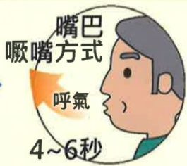

# 肺阻塞（COPD）肺部運動訓練

## 上身直立挺胸運動

## 什麼是肺阻塞？

呼吸道慢性發炎，不可逆的阻塞性疾病

台灣十大死因第八位

症状：咳

痰

喘

## 危險因子：

吸菸或二手菸

環境有害物質

或職業接觸

家族史

或其他肺部狀況

## 改善駝背 上身訓練重要性

1.駝背常見於COPD病人，除姿勢外型不佳，研究發現會造成肺功能下降及胸腔的緊繃感。

2.駝背程度越嚴重，肺功能越差，呼吸困难的症状更明顯。

1. Leech JA, Dulberg C, Kellie S, et al. Relationship of lung function to severity of osteoporosis in women. Am Rev Respir Dis. 1990;141(1):68–71.

3.透過上身訓練改善駝背嚴重度，進而改善呼吸困难症狀及減緩肺功能惡化。

## 參考資料來源

2. Culham EG, Jimenez HA, King CE. Thoracic kyphosis, rib mobility, and lung volumes in normal women and women with osteoporosis. Spine (Phila Pa 1976). 1994;19(11):1250–1255.

3. Schlaich C, Minne HW, Bruckner T, et al. Reduced pulmonary function in patients with spinal osteo-porotic fractures. Osteoporos Int. 1998;8(3): 261–267.

4. A Ghanbari, F Ghaffarinejad, F Mohammadi, et al. Effect of forward shoulder posture on pulmonary capacities of women. 2008 Jul;42(7):622-3.

## 聯絡資訊

<table border=1 style='margin: auto; width: max-content;'><tr><td style='text-align: center;'>義大醫院</td><td style='text-align: center;'>義大癌治療醫院</td><td style='text-align: center;'>義大大昌醫院</td></tr><tr><td style='text-align: center;'>地址:高雄市燕巢區角宿里義大路1號</td><td style='text-align: center;'>地址:高雄市燕巢區角宿里義大路21號</td><td style='text-align: center;'>地址:高雄市三民區大昌一路305號</td></tr><tr><td style='text-align: center;'>電話:07-6150011 轉 5072 肺阻塞個管師</td><td style='text-align: center;'>電話:07-6150022 轉 6477 肺阻塞個管師</td><td style='text-align: center;'>電話:07-5599123 呼吸胸腔科門診</td></tr></table>## 上身直立挺胸運動

向上伸展

## 雙手拿毛巾

向右伸展

向左伸展

伸展到最高時 吸氣2-3秒 吐氣4-6秒

每個動作10下，3個動作為1組，每日至少3組

 $ ^{*} $ 示範動作頻率與組數提供參考，可依個人狀況增減調整 $ ^{*} $ 

## 面對牆面 間隔一大步

雙腳打開 雙手撐牆

胸部往地面延伸 維持5~10秒

每次10下 每日至少3次

義大醫療 呼吸胸腔科