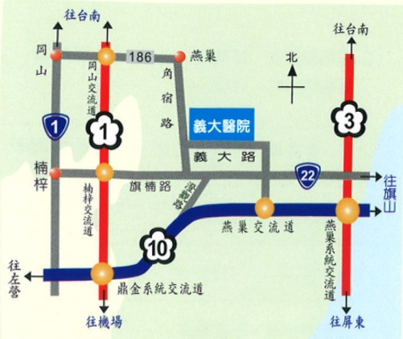

地址：高雄市824燕巢區角宿里義大路1號

電話：07-6150011

網址：edah@edah.org.tw

本著作權非經著作權人同意不得轉載翻印或轉售

著作權人：義大醫院

表單編號：HA-1-0058（2）

義大醫院 20×20cm 100.09印製 100.05修訂

泌尿道结石

## 泌尿道结石

## 一、 尿道结石的病因：

尿中各種游離子的濃度過高聚集結晶造成結石。

## 二、 泌尿道结石的症状：

1. 腰部鈍痛或腎絞痛，可能反射到睪丸（男性），可能反射到膀胱（女性）。

2. 感染：發冷或發燒。

3. 血尿、尿急、排尿不顺。

4. 可能因阻塞：引起腎水腫、尿滯留、腎功能受損。

## 三、 泌尿道结石的治療方式：治療方式仍需經由醫師評估

1. 體外震波碎石術。

2. 内視鏡取石術優先考慮使用。

3. 經皮腎臟造癢開刀治療。

## 四、 泌尿道结石的预防：

1. 多喝水稀釋尿液，建議每日飲水量2000C.C. ~ 3000C.C.以上，藉其沖刷的力量，將尿結石解出來。

2. 採均衡飲食，儘量減少含鈣、磷、草酸鹽、高普林食物。（見表一）

表一：

<table border=1 style='margin: auto; width: max-content;'><tr><td style='text-align: center;'>鈣、磷含量多的食物</td><td style='text-align: center;'>牛奶、乾酪、蚌、蝦、葡萄乾、麥片</td></tr><tr><td style='text-align: center;'>草酸鹽食物</td><td style='text-align: center;'>菠菜、蕃茄、可可、李子、杏仁、豆</td></tr><tr><td style='text-align: center;'>高普林食物</td><td style='text-align: center;'>動物內臟、沙丁魚、豆類</td></tr></table>

3. 要自然排尿，不要憋尿。

4. 發現小便顏色變深或解尿困難時，應儘早治療。

5. 安排適宜的休閒活動。

