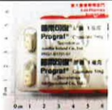
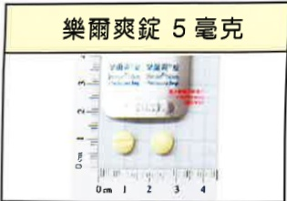

# 彩色人生的開始

## 肝臟移植病人照護手冊

姓 名：___

出生年月日：___

手 衔 日 期 ： ___

醫師姓名：___

就醫醫院：義大醫院

協 調 師 ：黃 麗 潔

連絡電話：07-6150011轉5855

肝臟移植手術是植入功能良好的肝臟取代原本功能較差的肝臟，使得身體狀況、生活品質因而逐漸改善。由於新植入的肝臟對自身免疫系統為外來物，故免疫系統會去攻擊它，為了避免新植入的肝臟受到免疫系統的攻擊，進而產生排斥反應，因此需終身服用（免疫抑制劑），服用抗排斥藥物會導致您較一般人容易受到感染，然而只要您多注意日常生活中的一些小細節，且配合醫囑按時服藥和定期門診追蹤，您可以恢復換肝前的生活品質。

## 肝臟移植手術後注意事項

## 一、 何謂排斥反應

排斥反應是由於本身免疫系統辨識出外來物所引發的防禦反應，較常發生在移植後三個月，排斥症狀有時不易與血管、膽管阻塞或感染等症狀區分，通常必須進一步做鑑別診斷與治療。所以，當您出現下列排斥症狀時，請與移植小組聯絡：

1、可能出现的症状如下：

(1) 發燒 (體溫持續  $ 38.5^{\circ} $ C 以上)。

(2)脈搏次數增加。

(3)腹部疼痛(特别是右上腹)。

(4)腹部快速增大。

(5)小便顏色變深（茶色尿），而大便顏色變淡（灰白便）。

(6)黄疸。

(7)食慾不佳。

(8)疲勞、倦怠。

(9)出現類似感冒的症狀(例如，發冷、發燒、腹部疼痛、肌肉痠痛、焦躁、不安、情緒起伏變化大，而若家人同時有感冒症狀時，請務必告知移植小組)。

2、鑑別診斷

(1) 抽血檢查。

(2)超音波檢查。

(3)肝臟切片檢查。

3、排斥反應的治療

(1) 增加免疫抑制剂的劑量。

(2)大量的類固醇(Methylprednisolone)靜脈注射。

(3) 增加其他免疫抑制剂(如MMF)的使用。

## 二、 感染症状

為了預防感染，應避免接觸感染病人，如水痘、麻疹…等，且居家生活的潔淨及正確的保健知識也是不可或缺的。以下是可能出現的感染症狀及相關處置方式：

## 1、 可能的症状

(1)咳嗽(肺部的感染)。

(2) 發燒 (體溫持續24小時以上高於38.5度以上)。

(3)皮膚傷口的異常變化（如發紅、腫脹、發熱、有液體滲出…等）。

(4)發疹（如曾接觸麻疹、水痘症狀病人或與發疹症狀的人同處一室

1 小時以上，而與在 24 小時內出現發疹現象者接觸等同於曾與發疹症狀病人接觸）。

2、鑑別診斷

(1)血液檢測。

(2)細菌或病毒培養。

(3)安排 X 光檢查。

3、感染症状的治療。

(1)調降免疫抑制劑的劑量。

(2)根據感染源投予抗生素、抗病毒劑或抗病毒球蛋白治療。

## 三、 飲食指導

## 1、 熱量、蛋白質建議需求

<table border=1 style='margin: auto; width: max-content;'><tr><td style='text-align: center;'></td><td style='text-align: center;'>移植前</td><td style='text-align: center;'>移植早期(急性期；移植後的前3個月)</td><td style='text-align: center;'>稳定期</td></tr><tr><td style='text-align: center;'>熱量</td><td style='text-align: center;'>一般患者30kcal/kg肥胖患者25kcal/kg</td><td style='text-align: center;'>30-35kcal/kg</td><td style='text-align: center;'>30kcal/kg</td></tr><tr><td style='text-align: center;'>蛋白質</td><td style='text-align: center;'>1.2-1.5g/kg/day</td><td style='text-align: center;'>1.5g/kg/day</td><td style='text-align: center;'>1-1.2g/kg/day</td></tr></table>

**肥胖定義為BMI>24以上者。

**身體質量指數(BMI)的算法：【體重(公斤)÷身高(公尺) $ ^{2} $ 】。

舉例：攝取1.5g蛋白質 / kg/day（例如：若體重 50 公斤，則一天需攝取 75 公克的蛋白質，約 7~8 份蛋白質食物）。

1 份蛋白質食物（1 份蛋白質食物 = 7 克蛋白質）

=1 兩肉類（雞、鴨、鵝、豬、牛、羊或魚，約三指寬大小）

=1 杯（190ml）豆漿

=1 顆雞蛋或 2 個雞蛋白

=1/2盒的嫩豆腐或2格傳統板豆腐

=2 個三角油豆腐

## 2、 移植早期及稳定期饮食指導

## (1) 移植前營養評估

對擇期手術或擬移植的肝硬化患者應及時進行營養不良篩檢和評估，以便在術前治療營養不良，從而改善體內蛋白質狀況。

(2) 移植早期(急性期；移植後的前3個月)

術後應考慮肌肉減少性肥胖和代謝症候群的風險，營養復健應以更早、更快恢復全身蛋白質和肌肉功能為目標，故此階段應攝取【高蛋白飲食】及獲得【足夠的熱量】。

## 飲食指導原則一

a. 足夠蛋白質 (1.5 g/kg) 及熱量攝取。

b. 服用免疫抑制劑前後 1 小時，禁食用葡萄柚(汁)與柚子(相關製品)前者會引起極危險副作用如痙攣、意識昏迷；後者則是會影響藥物的吸收。

c. 注意食品安全衛生，避免食用生食(生菜沙拉、生魚片、生蛋、生蠔、生肉、未殺菌之鮮乳)，留意食物需加熱煮沸完全才食用、隔餐勿食、用餐器皿使用前清潔消毒。

d.選擇帶皮水果並去除外皮，或將水果煮沸後再食用。

e. 避免任意食用補品和增強免疫食品(如：人蓼、銀杏、綠藻…等)，防止引發排斥反應。

f. 高血糖症狀(服用類固醇、免疫抑制劑)，需適當控制澱粉類食物，且避免精緻糖食物(果糖、砂糖等)、可將主食改為非精緻澱粉：雜糧或根莖類食物(南瓜、地瓜、糙米…等)。

g. 高血鉀症狀(免疫抑制)→減少高鉀食物攝取(香蕉、香瓜/木瓜、菜汁/肉湯、中藥湯/精力湯、運動飲料、雞精等)，亦可川燙青菜(2-3分鐘)後再油炒/拌油。

(3) 稳定期

經由適當的營養來維持移植器官的功能，減少因長期使用免疫抑制藥物所產生的代謝性問題，提昇生活品質。維持良好的營養狀況，避免營養素的缺乏，減少高血糖、高血脂、高血壓、肥胖的情形發生。## 飲食指導原則二

a. 適當熱量及蛋白質攝取維持理想體重，以均衡飲食為目的即可。

b. 蔬果攝取應充足，增加纖維質攝取→預防心血管疾病與三高問題。

C. 烹調用油以植物油(橄欖油、芥花油、葵花油、沙拉油)為主並適量攝取，減少動物用油(奶油、鮮奶油、豬油、牛油)使用。

d. 減少油炸、油煎、油酥食品；高油食物如動物皮(魚/豬皮)、肥肉（五花肉、蹄膀）、加工製品（臘肉、香腸、火腿）。

e. 少吃高膽固醇食物，如：動物內臟、海膽、魚卵、蟹黃…等。

f. 減少高飽和脂肪酸的食物如動物性脂肪(奶油、牛油、肥肉等)，加工後植物性油脂(植物性奶油、零食、西點麵包等)。

g.減少精製糖食物(砂糖、果糖等)攝取，以防止高血糖/血脂等三高問題產生。

h.飲食調味適當勿過鹹，以預防高血壓和水腫。

i. 長期服用類固醇者，可適當補充鈣質(高鈣食物)1200~1500mg/day。

## 四、 返家照護方面

1、如何監控排斥反應、感染症狀、藥物副作用

(1)測量並紀錄體溫、血壓變化（一天一次）。

(2)觀察尿液、大便的次數、顏色及性質（當發現茶色尿、灰白便時應立即告知移植小組）。

2、維持正常、規律的生活：調整生活作息，正常且規律。

3、潔淨的衛生習慣：您及您的家人須維持良好的衛生習慣。例如：勤洗手、飯後及進食後刷牙或漱口…等。

## 4、 活動或外出

(1)避免到人多的場合走動，若無法避免於人多的場合活動時，則應該戴口罩防護。

(2)劇烈運動（例如：跑步、游泳、性行為）應於手術後 6 個月才可以進行。

## 5、 牙科與眼科的追蹤

(1)定期(每6個月)的牙科檢查：檢查前需告知醫師正在服用的藥物若要接受牙科治療時，則必須先投予預防性抗生素治療。

(2)定期(每6~12個月)的眼科檢查：因類固醇有時會影響視力。

## 6、 預防注射

(1) 肝臟移植前後，B型肝炎疫苗皆為第一優先注射的疫苗。

(2)不可施打活性疫苗，應於半年後才可接種死菌疫苗，例如流感疫苗、肺炎鏈球菌疫苗…等。

(3) 小兒麻痺疫苗應改用非活性疫苗，即沙克注射疫苗。

## 7、 其他注意事项

(1)避免於室內種植植物或進入植物溫室栽培中心，以避免植物病源體的感染。

(2)應避免飼養動物，以減少病媒源的產生及感染。

(3)若有腹瀉現象，且水便達6次以上並持續12小時，建議勿馬上使用止瀉劑，而應回院進行大便培養。## 五、 追蹤計畫

## 1、 出院至一個月

(1) 每 1~2 週檢查白血球、腎功能、FK506(免疫抑制劑)血液濃度及血糖值。

(2)肝功能血液檢查項目。

## 2、 一個月至兩個月

(1) 每 2~4 週檢查白血球、腎功能、FK506(免疫抑制劑)血液濃度及血糖值。

(2)肝功能血液檢查項目。

3、之後每月複檢一次：檢查項目是依醫師檢查後而定。移植術後一年則每三個月回診一次。

(1) 白血球若 < 2000 即有感染的危险，需調整免疫抑制藥物劑量。

(2)肌酸肝(Creatinine)上升，表示有腎毒性產生，需調整免疫抑制藥物劑量。

(3) 肝功能上升，表示可能有排斥現象產生，需先鑑別診斷，再予以調整藥物劑量。

4、膽固醇指數及腫瘤指數每三個月檢查一次。

5、肝炎病毒抗原、抗體每三個月檢查一次，一年後則改每年檢查一次。

6、肝炎病毒量每六個月檢查一次。

7、腹部超音波每三個月一次，一年後則改每年檢查一次。

8、電腦斷層每年檢查一次。

肝臟移植手術的成敗與否，三成來自於移植團隊的努力及良好的照護品質，七成則需仰賴您及您的家人配合醫療處置、具備正確居家照護知識，而最重要的關鍵因素為良好的家庭支持系統。在居家照護過程中，若有任何的問題請撥以下諮詢電話：615-0011轉5855。

## 六、 移植術後使用的藥物

## 1、 預防器官移植排斥

<table border=1 style='margin: auto; width: max-content;'><tr><td colspan="3">FFK-506 短效型</td></tr><tr><td style='text-align: center;'>普樂可復 0.5 毫克</td><td style='text-align: center;'>普樂可復 1 毫克</td><td style='text-align: center;'>普樂可復 5 毫克</td></tr><tr><td style='text-align: center;'></td><td style='text-align: center;'></td><td style='text-align: center;'></td></tr></table>

FK-506 長效型

備註：本藥亦具抗發炎效果## 2、 預防移植術後感染用藥

<table border=1 style='margin: auto; width: max-content;'><tr><td style='text-align: center;'>孟克杏錠 480 毫克</td><td style='text-align: center;'></td><td style='text-align: center;'>[l]</td></tr><tr><td colspan="3">用途：预防肺部感染</td></tr><tr><td style='text-align: center;'>貝樂克 0.5 毫克</td><td style='text-align: center;'>欣苷 0.5 毫克</td><td style='text-align: center;'>芙苷寧 300 毫克 韋立得 2.5 毫克</td></tr><tr><td style='text-align: center;'></td><td style='text-align: center;'></td><td style='text-align: center;'></td></tr><tr><td colspan="3">用途：治療 B 型肝炎或預防 B 型肝炎復發</td></tr></table>

## 3、 其他

## 七、 術後傷口照護

為保持傷口平整、減少蟹足腫發生之機率，請每3天更換傷口紙膠(或美容膠)且至少貼3~6個月，若傷口有發紅、發癢難耐時，可先移除紙膠（或美容膠），待發紅、發癢症狀緩解再重新黏貼。黏貼方式為與傷口垂直且每片紙膠(或美容膠)需重疊(如下方圖示)。可淋浴，淋浴後將傷口上之紙膠(或美容膠)擦乾即可。

附錄 1

<table border=1 style='margin: auto; width: max-content;'><tr><td style='text-align: center;'>高鉀食物</td></tr><tr><td style='text-align: center;'>香蕉、草莓、哈密瓜、柳丁、芭樂、楊桃、蕃茄</td></tr><tr><td style='text-align: center;'>馬鈴薯、大頭菜、茼蒿、胡蘿蔔、油菜、萵苣、菠菜</td></tr><tr><td style='text-align: center;'>紅蒐菜、黃豆芽、草菇、綠色花椰菜、高麗菜芽</td></tr><tr><td style='text-align: center;'>咖啡、堅果類、運動飲料、巧克力、可可、低鈉醬油</td></tr></table>## 附錄 2

## 移植病人應避免使用中草藥、草本植物

<table border=1 style='margin: auto; width: max-content;'><tr><td colspan="2">【一】食物、中草藥與 Cyclosporine 及 Tacrolimus 的交互作用</td></tr><tr><td style='text-align: center;'>增加藥品的濃度</td><td style='text-align: center;'>洋甘菊、北美黃連、枳實、枳殼</td></tr><tr><td style='text-align: center;'>降低藥品的濃度</td><td style='text-align: center;'>黃芩、黃柏</td></tr><tr><td style='text-align: center;'>減少免疫抑制創的作用</td><td style='text-align: center;'>人參</td></tr><tr><td rowspan="2">保健食品</td><td style='text-align: center;'>銀杏(抑制凝血功能)</td></tr><tr><td style='text-align: center;'>紅麴(須先與醫師或藥師討論後，方可食用)</td></tr></table>

## 【二】與免疫抑制劑具有交互作用的常見中草藥、草本植物

<table border=1 style='margin: auto; width: max-content;'><tr><td style='text-align: center;'>洋甘菊</td><td style='text-align: center;'></td><td style='text-align: center;'></td><td style='text-align: center;'>枳實</td><td style='text-align: center;'></td><td style='text-align: center;'></td></tr><tr><td style='text-align: center;'>金絲桃草</td><td style='text-align: center;'></td><td style='text-align: center;'></td><td style='text-align: center;'>黃芩</td><td style='text-align: center;'></td><td style='text-align: center;'></td></tr><tr><td style='text-align: center;'>銀杏</td><td style='text-align: center;'></td><td style='text-align: center;'></td><td style='text-align: center;'>甘草</td><td style='text-align: center;'></td><td style='text-align: center;'></td></tr><tr><td style='text-align: center;'>枳殼</td><td style='text-align: center;'></td><td style='text-align: center;'></td><td style='text-align: center;'>黃連</td><td style='text-align: center;'></td><td style='text-align: center;'></td></tr></table>

## 服藥時間點注意事項

<table border=1 style='margin: auto; width: max-content;'><tr><td style='text-align: center;'>* 空腹狀態服藥(FK506、山喜多/睦體康)
吃藥  用餐 或 用餐 2小時 → 吃藥
* 回診注意事項
1. 回診當日早上若抽血，請勿服藥；抽完血後再服用
2. 請將藥物隨身攜帶，方便服用
3. 當天晚上的藥，請依日常時間點服用</td></tr></table>

07:00

09:00

服

抗

排

斥

藥

10:00

服早上飯後藥

19:00

前吃完晚餐

21:00

22:00

服

抗

排

斥

藥

服睡前藥

## 資料來源

☑ 藥品資訊：各藥品仿單、UpToDate資料庫

衛生福利部食品藥物管理署 中西藥併用咨詢資料庫

衛生福利部食品藥物管理署 食品藥物消費者枝事服務網-台灣食品成分資料庫 2017年版

## ☑臨床營養-膳食療養學

◆肝病防治學術基金會專刊

◆黃慧齡(2015)。肝移植的營養照護。彰化護理，22(1)，12-12。

☑Transplantation of the liver. 2005 p.491~503

◆EASL Clinical Practice Guidelines: Liver transplantation. Journal of Hepatology 2016;64(2): 433-485.<table border=1 style='margin: auto; width: max-content;'><tr><td style='text-align: center;'>日期/檢驗項目</td><td style='text-align: center;'></td><td style='text-align: center;'></td><td style='text-align: center;'></td><td style='text-align: center;'></td><td style='text-align: center;'></td><td style='text-align: center;'></td></tr><tr><td style='text-align: center;'>FK506 藥物濃度</td><td style='text-align: center;'></td><td style='text-align: center;'></td><td style='text-align: center;'></td><td style='text-align: center;'></td><td style='text-align: center;'></td><td style='text-align: center;'></td></tr><tr><td style='text-align: center;'>FK506(普樂可復)劑量</td><td style='text-align: center;'></td><td style='text-align: center;'></td><td style='text-align: center;'></td><td style='text-align: center;'></td><td style='text-align: center;'></td><td style='text-align: center;'></td></tr><tr><td style='text-align: center;'>MMF(山喜多/小溪)劑量</td><td style='text-align: center;'></td><td style='text-align: center;'></td><td style='text-align: center;'></td><td style='text-align: center;'></td><td style='text-align: center;'></td><td style='text-align: center;'></td></tr><tr><td style='text-align: center;'>體重</td><td style='text-align: center;'></td><td style='text-align: center;'></td><td style='text-align: center;'></td><td style='text-align: center;'></td><td style='text-align: center;'></td><td style='text-align: center;'></td></tr><tr><td style='text-align: center;'>血壓</td><td style='text-align: center;'></td><td style='text-align: center;'></td><td style='text-align: center;'></td><td style='text-align: center;'></td><td style='text-align: center;'></td><td style='text-align: center;'></td></tr><tr><td style='text-align: center;'>體溫</td><td style='text-align: center;'></td><td style='text-align: center;'></td><td style='text-align: center;'></td><td style='text-align: center;'></td><td style='text-align: center;'></td><td style='text-align: center;'></td></tr><tr><td style='text-align: center;'>日期/檢驗項目</td><td style='text-align: center;'></td><td style='text-align: center;'></td><td style='text-align: center;'></td><td style='text-align: center;'></td><td style='text-align: center;'></td><td style='text-align: center;'></td></tr><tr><td style='text-align: center;'>FK506 藥物濃度</td><td style='text-align: center;'></td><td style='text-align: center;'></td><td style='text-align: center;'></td><td style='text-align: center;'></td><td style='text-align: center;'></td><td style='text-align: center;'></td></tr><tr><td style='text-align: center;'>FK506(普樂可復)劑量</td><td style='text-align: center;'></td><td style='text-align: center;'></td><td style='text-align: center;'></td><td style='text-align: center;'></td><td style='text-align: center;'></td><td style='text-align: center;'></td></tr><tr><td style='text-align: center;'>MMF(山喜多/小溪)劑量</td><td style='text-align: center;'></td><td style='text-align: center;'></td><td style='text-align: center;'></td><td style='text-align: center;'></td><td style='text-align: center;'></td><td style='text-align: center;'></td></tr><tr><td style='text-align: center;'>體重</td><td style='text-align: center;'></td><td style='text-align: center;'></td><td style='text-align: center;'></td><td style='text-align: center;'></td><td style='text-align: center;'></td><td style='text-align: center;'></td></tr><tr><td style='text-align: center;'>血壓</td><td style='text-align: center;'></td><td style='text-align: center;'></td><td style='text-align: center;'></td><td style='text-align: center;'></td><td style='text-align: center;'></td><td style='text-align: center;'></td></tr><tr><td style='text-align: center;'>體溫</td><td style='text-align: center;'></td><td style='text-align: center;'></td><td style='text-align: center;'></td><td style='text-align: center;'></td><td style='text-align: center;'></td><td style='text-align: center;'></td></tr><tr><td style='text-align: center;'>日期/檢驗項目</td><td style='text-align: center;'></td><td style='text-align: center;'></td><td style='text-align: center;'></td><td style='text-align: center;'></td><td style='text-align: center;'></td><td style='text-align: center;'></td></tr><tr><td style='text-align: center;'>FK506 藥物濃度</td><td style='text-align: center;'></td><td style='text-align: center;'></td><td style='text-align: center;'></td><td style='text-align: center;'></td><td style='text-align: center;'></td><td style='text-align: center;'></td></tr><tr><td style='text-align: center;'>FK506(普樂可復)劑量</td><td style='text-align: center;'></td><td style='text-align: center;'></td><td style='text-align: center;'></td><td style='text-align: center;'></td><td style='text-align: center;'></td><td style='text-align: center;'></td></tr><tr><td style='text-align: center;'>MMF(山喜多/小溪)劑量</td><td style='text-align: center;'></td><td style='text-align: center;'></td><td style='text-align: center;'></td><td style='text-align: center;'></td><td style='text-align: center;'></td><td style='text-align: center;'></td></tr><tr><td style='text-align: center;'>體重</td><td style='text-align: center;'></td><td style='text-align: center;'></td><td style='text-align: center;'></td><td style='text-align: center;'></td><td style='text-align: center;'></td><td style='text-align: center;'></td></tr><tr><td style='text-align: center;'>血壓</td><td style='text-align: center;'></td><td style='text-align: center;'></td><td style='text-align: center;'></td><td style='text-align: center;'></td><td style='text-align: center;'></td><td style='text-align: center;'></td></tr><tr><td style='text-align: center;'>體溫</td><td style='text-align: center;'></td><td style='text-align: center;'></td><td style='text-align: center;'></td><td style='text-align: center;'></td><td style='text-align: center;'></td><td style='text-align: center;'></td></tr><tr><td style='text-align: center;'>日期/檢驗項目</td><td style='text-align: center;'></td><td style='text-align: center;'></td><td style='text-align: center;'></td><td style='text-align: center;'></td><td style='text-align: center;'></td><td style='text-align: center;'></td></tr><tr><td style='text-align: center;'>FK506 藥物濃度</td><td style='text-align: center;'></td><td style='text-align: center;'></td><td style='text-align: center;'></td><td style='text-align: center;'></td><td style='text-align: center;'></td><td style='text-align: center;'></td></tr><tr><td style='text-align: center;'>FK506(普樂可復)劑量</td><td style='text-align: center;'></td><td style='text-align: center;'></td><td style='text-align: center;'></td><td style='text-align: center;'></td><td style='text-align: center;'></td><td style='text-align: center;'></td></tr><tr><td style='text-align: center;'>MMF(山喜多/小溪)劑量</td><td style='text-align: center;'></td><td style='text-align: center;'></td><td style='text-align: center;'></td><td style='text-align: center;'></td><td style='text-align: center;'></td><td style='text-align: center;'></td></tr><tr><td style='text-align: center;'>體重</td><td style='text-align: center;'></td><td style='text-align: center;'></td><td style='text-align: center;'></td><td style='text-align: center;'></td><td style='text-align: center;'></td><td style='text-align: center;'></td></tr><tr><td style='text-align: center;'>血壓</td><td style='text-align: center;'></td><td style='text-align: center;'></td><td style='text-align: center;'></td><td style='text-align: center;'></td><td style='text-align: center;'></td><td style='text-align: center;'></td></tr><tr><td style='text-align: center;'>體溫</td><td style='text-align: center;'></td><td style='text-align: center;'></td><td style='text-align: center;'></td><td style='text-align: center;'></td><td style='text-align: center;'></td><td style='text-align: center;'></td></tr><tr><td style='text-align: center;'>日期/檢驗項目</td><td style='text-align: center;'></td><td style='text-align: center;'></td><td style='text-align: center;'></td><td style='text-align: center;'></td><td style='text-align: center;'></td><td style='text-align: center;'></td></tr><tr><td style='text-align: center;'>FK506 藥物濃度</td><td style='text-align: center;'></td><td style='text-align: center;'></td><td style='text-align: center;'></td><td style='text-align: center;'></td><td style='text-align: center;'></td><td style='text-align: center;'></td></tr><tr><td style='text-align: center;'>FK506(普樂可復)劑量</td><td style='text-align: center;'></td><td style='text-align: center;'></td><td style='text-align: center;'></td><td style='text-align: center;'></td><td style='text-align: center;'></td><td style='text-align: center;'></td></tr><tr><td style='text-align: center;'>MMF(山喜多/小溪)劑量</td><td style='text-align: center;'></td><td style='text-align: center;'></td><td style='text-align: center;'></td><td style='text-align: center;'></td><td style='text-align: center;'></td><td style='text-align: center;'></td></tr><tr><td style='text-align: center;'>體重</td><td style='text-align: center;'></td><td style='text-align: center;'></td><td style='text-align: center;'></td><td style='text-align: center;'></td><td style='text-align: center;'></td><td style='text-align: center;'></td></tr><tr><td style='text-align: center;'>血壓</td><td style='text-align: center;'></td><td style='text-align: center;'></td><td style='text-align: center;'></td><td style='text-align: center;'></td><td style='text-align: center;'></td><td style='text-align: center;'></td></tr><tr><td style='text-align: center;'>體温</td><td style='text-align: center;'></td><td style='text-align: center;'></td><td style='text-align: center;'></td><td style='text-align: center;'></td><td style='text-align: center;'></td><td style='text-align: center;'></td></tr></table>

地址：82445 高雄市燕巢區角宿里義大路 1 號

電話：07-6150011轉5855

本著作權非經著作權人同意不得轉載、翻印或轉售

著作權人：義大醫療財團法人義大醫院器官移植中心、藥劑部 & 營養臨床組

義大醫療財團法人 2024.08印製 2024.06修訂 HA-1-0166(2)