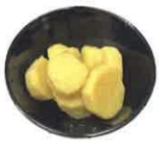
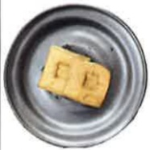
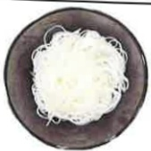

## 慢性腎臟疾病 飲食建議表

## 飲食代換圖表及攝取量建議

(熱量：___ 大卡/天 蛋白質：___ 公克/天)

<table border=1 style='margin: auto; width: max-content;'><tr><td style='text-align: center;'>類別</td><td style='text-align: center;'>建議份數/天</td><td colspan="4">食物代換表</td></tr><tr><td rowspan="5">主食</td><td rowspan="5">早:   碗午:   碗晚:   碗</td><td style='text-align: center;'></td><td style='text-align: center;'></td><td style='text-align: center;'></td><td style='text-align: center;'></td></tr><tr><td style='text-align: center;'>飯1碗</td><td style='text-align: center;'>=粥2碗</td><td style='text-align: center;'>=羅蔔糕4塊</td><td style='text-align: center;'>=*吐司2片</td></tr><tr><td style='text-align: center;'></td><td style='text-align: center;'></td><td style='text-align: center;'></td><td style='text-align: center;'></td></tr><tr><td style='text-align: center;'>=碗粿1個</td><td style='text-align: center;'>=地瓜2碗</td><td style='text-align: center;'>=*水飯皮12片</td><td style='text-align: center;'>=*饅頭1顆</td></tr><tr><td style='text-align: center;'></td><td style='text-align: center;'></td><td colspan="2">※有*表低生理價蛋白質較高,減少食用,選擇米製品優於麵粉製品※避免雜糧穀類,如:五穀米、糙米、麥片、紫米、小米</td></tr><tr><td style='text-align: center;'>蔬菜</td><td style='text-align: center;'>___份</td><td style='text-align: center;'></td><td style='text-align: center;'></td><td colspan="2">生重100克青菜</td></tr><tr><td rowspan="4">豆魚蛋肉</td><td rowspan="4">早:   份午:   份晚:   份</td><td style='text-align: center;'></td><td style='text-align: center;'></td><td style='text-align: center;'></td><td style='text-align: center;'></td></tr><tr><td style='text-align: center;'>蛋1顆</td><td style='text-align: center;'>=豆漿1杯</td><td style='text-align: center;'>=肉絲2匙</td><td style='text-align: center;'>=蝦子3隻</td></tr><tr><td style='text-align: center;'></td><td style='text-align: center;'></td><td style='text-align: center;'></td><td style='text-align: center;'></td></tr><tr><td style='text-align: center;'>=小方豆干2片</td><td style='text-align: center;'>=濕豆包半個</td><td style='text-align: center;'>=牡蠣2匙</td><td style='text-align: center;'>=魚、雞、豬肉三指大小</td></tr></table>

美大聚感财圈法人 21X29.7cm 2024.06印製

2024.03修訂 HA-3-0036(2)## 義大醫療財團法人 E-DA HEALTHCARE GROUP

<table border=1 style='margin: auto; width: max-content;'><tr><td style='text-align: center;'>低氮澱粉</td><td style='text-align: center;'>早:__碗午:__碗晚:__碗</td><td colspan="4">   米苔目半碗=冬粉半碗=米粉半碗=粉圓半碗(生重15克)   =地瓜粉2匙=蓮藕粉2匙=太白粉1.5匙=西谷米半碗(生重15克)※腎友可依建議選用,取代一餐或當點心補充</td></tr><tr><td style='text-align: center;'>水果</td><td style='text-align: center;'>——份</td><td style='text-align: center;'>   蓮霧2顆 葡萄9顆 鳳梨5小塊 水梨3塊  蘋果1個 橘子1個</td><td colspan="3">※避免經常性攝取高鉀水果(如:水蜜桃、草莓、奇異果、美濃瓜、哈密瓜、小番茄、香蕉、香瓜...等)。</td></tr><tr><td style='text-align: center;'>營養配方</td><td style='text-align: center;'>——包/罐</td><td colspan="4">     </td></tr></table>

參考資料：食物代換表 衛生福利部國民健康署2019.5版

本著作權非經著作權人同意不得轉載翻印或轉售

<table border=1 style='margin: auto; width: max-content;'><tr><td colspan="3">聯絡資訊</td></tr><tr><td style='text-align: center;'>義大醫院地址：高雄市燕巢區角宿里義大路1號電話：07-6150011</td><td style='text-align: center;'>義大癌治療醫院地址：高雄市燕巢區角宿里義大路21號電話：07-6150022</td><td style='text-align: center;'>義大大昌醫院地址：高雄市三民區大昌一路305號電話：07-5599123</td></tr></table>

养大聚液财團法人 21X29.7cm 2024.06印製

2024.03修訂 HA-3-0036(2)