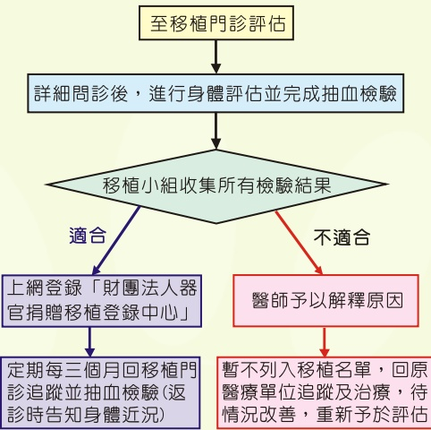

物的種類及使用注意事項、營養的攝取等，同時我們也希望家人能配合及瞭解您移植術後的所需照顧。因為移植術後自我照顧、服藥及定期門診追蹤，是需要家人及朋友的支持系統，這都會影響腎臟移植術後的成功率。

## 醫院的移植團隊有哪些人？

1. 移植醫師。

2. 器官移植協調師。

3. 臨床專科護理師。

4. 移植病房護理人員。

5. 精神科醫師。

6. 社會工作人員。

7. 臨床藥劑師。

8. 臨床營養師。

每位醫療人具有不同角色及功能，如果有任何問題請主動詢問，讓移植團隊能瞭解您的需要，以提供您最需要的協助。

整體來說，腎臟移植不僅讓病患免除透析治療之苦，其飲食限制變少，同時延長生命，更享有正常的生活品質。由於術後病患須終身服用抗排斥藥物，故決定接受腎臟移植前應接受專業審慎的評估，術後更應該與移植團隊密切配合及追蹤，才能避免移植腎的排斥反應及服用抗排斥藥物副作用的發生。

腎臟移植門診、器官移植中心及聯絡電話：

泌尿科 王華斌醫師 禮拜一/禮拜二/禮拜三上午

、禮拜四下午

泌尿科 江朝洋醫師 禮拜三下午、禮拜四早上、禮拜六早上

協調師：

諮詢電話：07-6150011分機5853、5852、5855

## 義大醫院

地址:高雄市燕巢區角宿里義大路1號

電話(07)615-0011

網址: http://www.edah.org.tw

## 認識腎臟移植

## 等待腎臟移植之術前 臨床評估流程

## 一、 何謂腎臟移植？

腎臟移植是指將有功能的腎臟(通常由腦死病人家屬同意捐贈、五等親內的健康家屬或是配偶所捐贈）移植至受贈者身上，以取代失去功能的腎臟，發揮應有代謝功能的一種器官移植手術。

## 二、 那些人適合接受腎臟移植手術？

大部分末期腎衰竭（尿毒症）的患者，須仰賴血液透析或腹膜透析以維持生命者，幾乎都合適做腎臟移植，除非患者本身有其他禁忌，例：惡性腫瘤、全身感染、嚴重心血管疾病、凝血機制異常、慢性呼吸功能衰竭、心衰竭、精神病、嚴重泌尿系統先天畸形、AIDS等，但仍須由腎臟科醫師及泌尿科醫師的評估。

## 三、 腎移植的手術成功率有多少?有什麼危險性?及併發症?

手術的成功率依其捐贈來源而定：由健康親屬捐贈，第一年的移植腎存活率高於 98%：若是由無親屬關係的腦死病患捐贈，則成功率約 80-90%。腎臟移植手術的危險性及併發症和其他手術相同，大部分的併發症只需藥物治療，只有少數較嚴重併發症需要作侵入性的治療。

## 四、 親屬之間可以作腎移植嗎？

等待一顆腎臟是可遇而不可求。根據器官移植條例規定：活體腎臟捐贈以移植於其配偶或五親等以內之血親為限，由於進行親屬移植的優點除了縮短受贈者等候期，又捐贈者健康狀況穩定，有充分時間為捐贈者進行檢查，親屬捐贈之腎移植有較高成功率，因此目前愈來愈多的病人接受親屬腎移植。而活體腎臟移植捐贈者須具備什麼條件：

1. 年齡在20歲以上及70歲以下健康成人。

2.兩個腎臟功能皆正常。

3. 無糖尿病、高血壓、肺結核等慢性疾病，無腫瘤病史或具高度傳染性疾病（如：AIDS）

4.自願捐出腎臟，且動機純正。

## 五、 我若捐贈一顆腎臟，對健康會有什麼影響？在捐贈前要做些什麼檢查？

在正常狀況下，人體捐出一個腎臟後，另一個腎臟能負擔起全部的腎臟功能，對於整體身體的生理功能並無不良影響。捐贈前要先做：

1. 驗血型及組織配對檢查，並做混合淋巴球培養之交叉配對試驗。

2. 檢驗肝腎功能，作尿液分析及培養檢查。

3. 心電圖、胸部X光、臀部超音波。

4. 精神科醫師及社工人員會診評估。

## 六、 活體腎移植手術需要自費嗎？健保有給付

嗎？捐贈腎臟手術後多久可以出院？多久可以回復正常生活？

目前健保是有給付活體腎移植者的術前評估及手術，不需要自費，僅需要負擔部分費用(如額外的病房費用或伙食費)即可。一般捐贈者平均在術後5-7天即可出院。若無不適情形，出院後注意傷口照顧，定期回診，是不會影響日常生活的。

## 七、 移植手術後的照顧

腎移植手術是取下捐贈者的腎臟，植入受腎者左側或右側下腹部，新腎的血管與受腎者相連，輸尿管則與受腎者膀胱接通。原有的腎並不摘除，移植手術時間約4-5小時。住院期間約2週。住院期間移植醫師、專科護理師及病房護理人員協助您的適應術後的身體變化、瞭解排斥及感染的症状，並協助您學習自我觀察及居家自我照顧。器官移植協調師、臨床藥劑師及營養師也會探視，協助您瞭解抗排斥藥