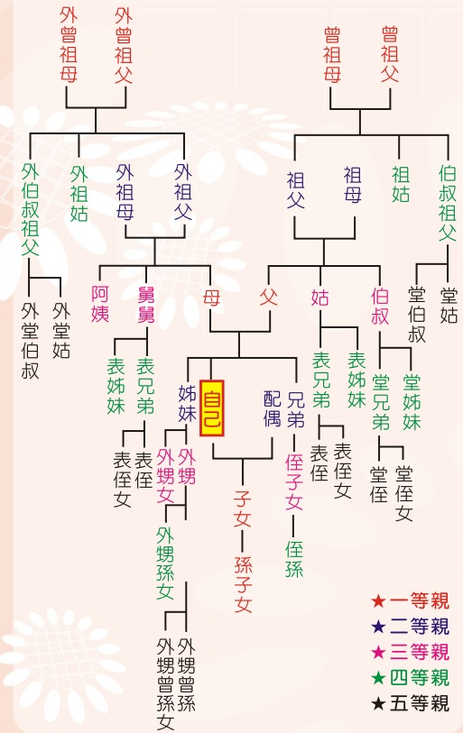

## Living Liver Donor Preoperative Evaluation Process

## Introduction to Living Liver Donor Surgery

The first living liver donor surgery was performed nearly thirty years ago. According to the Ministry of Health and Welfare, the one-year survival rate after liver transplantation reaches 93%, and the five-year survival rate reaches 75%. Liver transplantation is a primary life-saving treatment when the liver suffers irreversible damage, but there is a severe shortage of liver donors. Therefore, living liver donation provides patients with another option.

## Liver Transplant Recipient Preoperative Evaluation Process

## I. Conditions Donors Must Meet

(1) Voluntary donation.

(2) Must be a relative within the fifth degree of kinship.

## (3) Must be at least 18 years old (written consent from a legal guardian is required).

(4) The spouse should have children with the liver donor or have been married for more than 2 years; however, if diagnosed by a physician with transplant indications after one year of marriage, this condition does not apply.

## II. Explanation of Fifth Degree of Kinship

