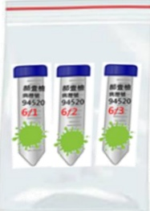
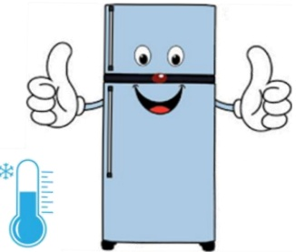

# Sputum Examination Collection Education Sheet

I. Examination Items: Xpert MTB (Rapid Molecular Test for Tuberculosis), Mycobacteria Culture and Acid-Fast Staining, Routine Sputum Examination + Aerobic Bacteria Culture, Sputum Gram Staining

## II. Precautions Before Collection:

1. ☐ Xpert MTB: After receiving the container, try to cough sputum within the hospital and submit it promptly for early diagnosis. When coughing sputum in the hospital, please go to a less crowded area to avoid cross-infection.

2. The best time to collect sputum specimens is the first sputum of the morning.

3. Before coughing sputum, please rinse your mouth with clean water to avoid oral substances affecting the test results.

## III. Collection Steps:

1. Cough sputum forcefully from deep in the respiratory tract, not saliva (spit), and spit the sputum into a 50mL sterile centrifuge tube. Immediately close the lid of the collection container tightly; do not reopen it to avoid contamination affecting the test results.

2. Mark the collection date on the container and package it in a double-layer ziplock bag.

3. If multiple sets of specimens are required, collect separately each day following the above method, mark the date on each container, collect for 3 consecutive days, and submit all specimens on the 3rd day.

## IV. Precautions After Collection:

1. Submit the specimen to the receiving window as soon as possible, or store refrigerated (place ice packs outside the ziplock bag) and complete delivery within 3 days.

2. When delivering to the laboratory receiving window, confirm with the receiver that the information and dates are correct.

3. If 3 sets of specimens are required, refrigerate the specimens from the first two days, then refrigerate together with the specimen from the 3rd day for delivery. Do not exceed 3 days before delivery; for example, if collected on Monday, the latest delivery is by Wednesday.

Package in double-layer ziplock bags and store refrigerated.

During transport, place ice packs or ice cubes outside the specimen bag to maintain a low-temperature environment.

## 4. Specimen Receiving Hours:

<table border=1 style='margin: auto; width: max-content;'><tr><td style='text-align: center;'></td><td style='text-align: center;'>Monday~Friday</td><td style='text-align: center;'>Saturday</td><td style='text-align: center;'>Contact Phone</td></tr><tr><td style='text-align: center;'>E-Da Hospital</td><td style='text-align: center;'>07:00~21:30</td><td style='text-align: center;'>07:00~12:00</td><td style='text-align: center;'>07-6150011 ext. 2803</td></tr><tr><td style='text-align: center;'>E-Da Cancer Treatment Hospital</td><td style='text-align: center;'>07:00~17:00</td><td style='text-align: center;'>07:00~12:00</td><td style='text-align: center;'>07-6150022 ext. 6285</td></tr><tr><td style='text-align: center;'>E-Da Dachang Hospital</td><td style='text-align: center;'>07:00~21:30</td><td style='text-align: center;'>07:00~12:00</td><td style='text-align: center;'>07-5599123 ext. 7216</td></tr></table>

Reference Sources: EDCP-SOP-T-0301, EDCP-SOP-M-0204, Cai Wencheng (2021). Practical Clinical Microbiological Diagnostics (12th Edition). Taipei: Kyushu Publishing.

<table border=1 style='margin: auto; width: max-content;'><tr><td colspan="3">Contact Information</td></tr><tr><td style='text-align: center;'>E-Da Hospital Address: No. 1, Yida Road, Jiaosu Village, Yanchao District, Kaohsiung City Phone: 07-6150011</td><td style='text-align: center;'>E-Da Cancer Treatment Hospital Address: No. 21, Yida Road, Jiaosu Village, Yanchao District, Kaohsiung City Phone: 07-6150022</td><td style='text-align: center;'>E-Da Dachang Hospital Address: No. 305, Dachang 1st Road, Sanmin District, Kaohsiung City Phone: 07-5599123</td></tr></table>

E-Da Medical Foundation 21×29.7cm Printed April 2025