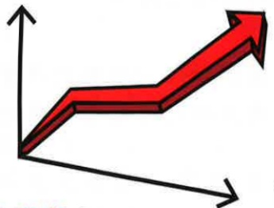
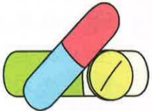
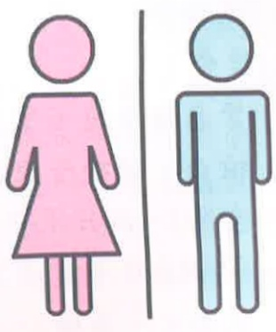
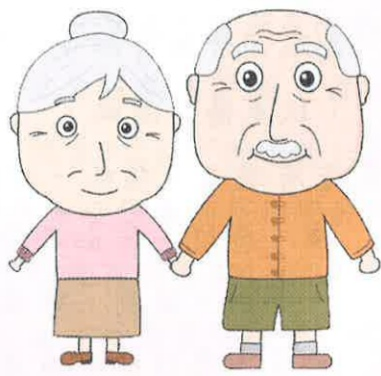
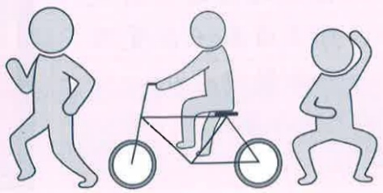
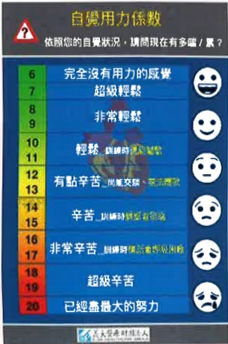
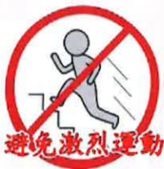

# 急性心肌梗塞注意事项

## 目鏘

一、什麼是急性心肌梗塞……01    
二、心肌梗塞常見症狀……01    
三、危險因子……02    
四、治療種類及方式：……04    
1. 冠狀動脈氣球擴張術……04    
2. 血栓抽吸手術……04    
3. 冠狀動脈支架置放術……04    
4. 外科治療--冠狀動脈繞道手術……05    
5. 藥物治療……05    
五、心導管執行之注意事項……06    
六、心肺復健須知及注意事項……12    
七、急性心肌梗塞藥物說明……16    
八、營養照護須知……20    
九、返家照護須知及修正生活方式……25    
十、血壓、心跳及血糖記錄表……27    
十一、抽血報告紀錄表……29## 一、 什麼是急性心肌梗塞？

當供應心臟的血管發生狹窄或阻塞，心肌無法獲得足夠的氧氣及營養，此時心臟肌肉會產生壞死及缺氧的情形，進而影響心臟功能及心肌細胞，嚴重時會危及病人的生命。所以當心肌梗塞發作時，須於最短時間爭取時效儘快將血管打通，使得心肌缺氧的傷害降到最低。

## 二、 心肌梗塞常見症狀：

1. 胸骨下有壓迫收縮性疼痛，沈重感、燒灼感或難以形容之不舒適。如有持續性的胸痛，可持續30分鐘或更久，通常使用硝酸甘油酯（NTG）或休息都無法緩解，沒有特定的發作時間，嚴重時會呼吸困難、失去意識、心律不整、血壓下降甚至休克。

2. 疼痛可能反射到手臂、肩、頸部、下巴或背部，常伴有虛弱感、出汗、噁心、嘔吐、頭暈、消化不良及腹部脹氣。

3. 心肌梗塞發生後24-48小時可能會出現發燒現象。

## 三、 危險因子：

### 1. 年齡：

隨著年齡的增長，缺血性心臟病的發生率隨之增加。

### 2. 性别：

男性—缺血性心臟病發生率約於四十五歲後迅速增加。

女性—在五十五歲後或停經後逐漸增加。

### 3. 家族病史：

父母雙方有一人罹患心肌梗塞疾病者，其子女發生心肌梗塞機率會增加。

### 4. 膽固醇過高：

血中的膽固醇愈多，堆積於血管壁愈來愈厚，會造成斑塊產生，導致動脈硬化、血管內徑變狹小，容易引發血管阻塞，而缺血性心臟病發生率與低密度脂蛋白膽固醇(LDL)濃度成正比，而與高密度膽度醇濃度(HDL)成反比。### 5. 高血壓：

血壓升高更容易破壞血管內皮細胞的穩定，膽固醇容易進入血管內壁形成血管硬化阻塞。

### 6. 糖尿病：

增加冠狀動脈氧化壓力和胰島素阻抗，而在高血糖的環境下，斑塊更容易堆積在血管內，罹患糖尿病會使缺血性心臟病的風險提高為二倍。

### 7. 過重或肥胖：

過重或肥胖會引發血壓升高，血脂過高，糖尿病進而誘發缺血性心臟病。

### 8. 缺乏運動(久坐):

缺乏運動將使缺血性心臟病的發生風險提高為兩倍左右，而且缺乏運動會使其他危險因子更加惡化。

### 9. 饮食不均衡：

飲食攝取若以飽和脂肪、反式脂肪和膽固醇含量較高的食物為主，容易引發缺血性心臟病。

## 四、 治療種類及方式：

### 1. 冠狀動脈氣球擴張術：

利用心導管，從下肢股動脈(或上肢橈動脈)插入導管，利用導線，將氣球置入冠狀動脈狹窄部位，再將氣球擴張，利用其壓力將已阻塞部分撐開，以增加血流量。另一方面，我們亦可以利用冠狀動脈血管支架，以心導管將「血管支架(Stent)」送入冠狀動脈狹窄處，可得到更好的效果。

### 2. 血栓抽吸手術：

在執行緊急心導管時，若發現大量血栓時，可採用「血栓抽吸手術」把血栓清除，目的在避免遠端微小血管栓塞之發生，及其可能造成血管支配區域心肌細胞灌流不足之後果，更能進一步減少心肌細胞壞死之區域。

### 3. 冠状動脈支架置放術：

血管氣球擴張術執行中，醫師會視病人情況，選擇在病人血管狹窄處放置一個載有金屬支架的球囊導管稱做『支架』，防止血管又再度堵塞起來。支架分為一般金屬支架與塗藥支架。

### 4. 外科治療--冠狀動脈繞道手術：

當冠狀動脈阻塞的嚴重情況，不適合以氣球擴張或支架放置來治療時，就需要外科介入來實施冠狀動脈繞道術，以解決病人心肌缺血的問題，及避免心肌梗塞所引起的猝死。

### 5. 藥物治療：

藥物治療可以改善心臟功能，減少發作及症狀減輕，但不能讓狹窄血管還原。目前有多項藥物可用來增加氧氣之供應或減少氧氣之需求，例如硝酸鹽類、乙型交感神經阻斷劑、鈣離子阻斷劑、血管緊縮素轉換酶抑制劑、抗血小板藥物等。

## 五、 心導管執行之注意事項

1. 心導管檢查前：

(1)生理學上評估：

抽血、心電圖、

X 光檢查。

(2) 同意書：

必須包括病人及家屬的同意、簽章。

(3)皮膚準備：

避免減少手術過程感染，故一般執行檢查時，會建議將手臂、大腿以上3/1及雙側鼠蹊部剃毛。

(心導管檢查常見執行部位為手腕或鼠膝部)

(4) 禁食：

緊急檢查時不需禁食。隔日早上執行檢查，請於午夜12點後禁食(包含水、食物)。隔日下午執行檢查，可吃早餐（7AM前進食完畢），早餐後開始禁食（包含水、食物）。(5)檢查當日請摘除身上金屬飾品、活動性假牙，若有塗指甲油或口紅應擦拭乾淨。檢查當日穿著病人服，不穿內衣褲。

(6)疾病過去史：

過敏體質(曾對顯影劑過敏)、出血不止等情形，請事先告知醫師。

(7) 脈動檢查：

護理人員會為您檢查血壓、脈搏並在雙腳脈搏跳動點做上記號，以利比較前後脈動強弱有無改變。

(8)檢查前請排空膀胱。

### 2. 心導管檢查中：

(1) 採局部消毒及麻醉，使用特殊導管經由手

## 檢查中

臂或鼠蹊處的血管插入，順著血管到達心臟。

(2)檢查過程中是清醒的，進行的過程中可能需要您配合用力咳嗽，以促進冠狀動脈血流。

(3)在注射顯影劑時，可能會有全身發熱、噁心、嘔吐的感覺，請您不用擔心，此感覺很快就會消失。

(4)執行過程中若有不適如：胸悶、發冷、發熱、心悸及呼吸困难等症狀，請告知醫護人員。

### 3. 心導管檢查後：

(1)返回病室後密切監測血壓及心跳每15分鐘x1小時，之後30分鐘x3小時。

(2)檢查部位若為手腕，醫護人員使用止血加壓帶或紗布及寬膠環繞加壓穿刺處，4小時後會開始漸進式拆除部份寬膠，隔天早上才會完全拆除，並重新換藥以防水膠膜固定，檢查之肢體勿出力，術後1星期內避免提重物。

(3)檢查部位若為鼠蹊部，若導管已在檢查室移除者，心導管室醫護人員會在您的穿刺部位使用加壓器直接加壓30分鐘止血，之後放置一個重約2公斤的砂袋加壓4小時，穿刺部位不可彎曲保持砂袋於患處。砂袋加壓移除後需再平躺4~6小時避免翻身，以防出血。砂袋移除後可以採半坐臥，注意傷口出血情形。

(4)行鼠蹊部之股動脈檢查且導管未移除者，導管拔除前須平躺，拔除導管後仍須以砂袋加壓4小時平躺6小時，臀部可左右移動，患肢關節須保持平直，不可彎曲避免用力，腳踝可自由活動並會固定時間為您評估生命徵象及上肢或下肢血循及溫度。

(5)檢查後返回病室，應先完全臥床休息4小時，如需解尿請使用便盆或尿壺，6小時未解時，請告知護理人員。若傷口於鼠蹊部者如有解便困難請告知醫護人員，以免傷口流血。

(6)若有噁心、嘔吐、心悸、呼吸困难、胸痛、發燒、出血及檢查側的肢體有冰冷、蒼白、麻刺、疼痛感及異常腫脹感、瘀青、傷口紗布有濕熱、疼痛等不適情形，應即刻告知醫護人員。(7)若無特殊禁忌，返回病室後即可正常飲食。

(8)檢查隔日早上，護理人員會去除敷料，並傷口消毒以紗布及防水膠膜覆蓋。若無不適隔日可去除紗布，並檢視傷口旁有無瘀青，並告知醫師，約二至三週皮膚瘀青情形會逐漸消退。

普通病房

## 六、 心肺復健須知及注意事項

## 第一階段：加護病房、普通病房復健

1. 執行心導管後第一天：可練習深呼吸運動漸進床頭搖高坐立、在治療人員監督保護之下可坐立到床邊、執行肢體運動(非阻力)。

2. 執行心導管後第二天含以上：延續第一天的運動，另可在治療人員監督保護之下可下床站立、原地踏步、執行輕度肢體阻力運動。

1. 第一天：

在無胸痛或不適症狀下，可慢速散步漸近至十分鐘，每天三次。

2. 第二天：

在無胸痛或不適症狀下，可上樓梯半層樓、下樓梯一層樓。

3. 第三天含以上：

在無胸痛或不適症狀下，可上下樓梯一層樓。

此階段可自行坐起用餐、盥洗、換衣、閱讀等其他靜態活動。## 第二階段：復健科門診復健

建議出院後至少為期六週，每週三次的復健訓練，物理治療師將依照病人的訓練目標制定復健計畫，其中包含：

1. 熱身運動

-輕度阻力訓練

-肢體活動

-自覺用力係數<8

2. 心肺復健運動

- 跑步機、腳踏車、手搖車或其他制定項目

- 自覺用力係數≤13

3. 緩和運動

-輕度緩和運動

-柔軟度運動

-自覺用力係數<8

<table border=1 style='margin: auto; width: max-content;'><tr><td style='text-align: center;'>6</td><td style='text-align: center;'>完全沒有用力</td></tr><tr><td style='text-align: center;'>7</td><td style='text-align: center;'>超級輕鬆</td></tr><tr><td style='text-align: center;'>8</td><td rowspan="2">非常輕鬆</td></tr><tr><td style='text-align: center;'>9</td></tr><tr><td style='text-align: center;'>10</td><td style='text-align: center;'>輕鬆</td></tr><tr><td style='text-align: center;'>11</td><td style='text-align: center;'>副練時還能唱歌</td></tr><tr><td style='text-align: center;'>12</td><td style='text-align: center;'>有點辛苦</td></tr><tr><td style='text-align: center;'>13</td><td style='text-align: center;'>尚能交談無法唱歌</td></tr><tr><td style='text-align: center;'>14</td><td style='text-align: center;'>辛苦</td></tr><tr><td style='text-align: center;'>15</td><td style='text-align: center;'>副練時講話會很嗚</td></tr><tr><td style='text-align: center;'>16</td><td style='text-align: center;'>非常辛苦</td></tr><tr><td style='text-align: center;'>17</td><td style='text-align: center;'>副練時講話會呼吸困難</td></tr><tr><td style='text-align: center;'>18</td><td rowspan="2">超級辛苦</td></tr><tr><td style='text-align: center;'>19</td></tr><tr><td style='text-align: center;'>20</td><td style='text-align: center;'>已經盡最大努力</td></tr></table>

過程中應由物理治療師全程監測生命徵象，以確保病人安全，當休息時的血壓<90/50或>160/90mmHg；心跳<50或>100bpm時則無法接受復健運動。

此階段可以進行輕度家事如掃地、拖地、烹飪，在醫師同意下可從事性行為。

## 六、 心肺復健須知及注意事項

## 第二階段：復健科門診復健

## 接受門診復健流程：

當病人出院後回診心臟內科醫師，醫師判斷病人適合接受復健時，將會轉介到復健科門診，復健科醫師評估、衛教及開立醫囑後，由物理治療師執行制定心肺復健計畫和心肺復健相關衛教。

## 第三階段：社區居家復健

病人在無胸痛或不適症狀下，應在居家就近的社區、學校、健身房養成規律運動習慣，如：快走、慢跑、腳踏車、游泳、舞蹈、太極拳等，每週三次以上，每次三十分鐘以上。

## 門診復健注意事項：

1. 復健運動前應正常飲食勿空腹，飯後一小時內應避免復健運動。

2. 穿著適合運動的輕便裝束：運動服、運動鞋、毛巾。

3. 復健運動後適當補充水分，響應環保請自帶環保杯。

4. 請勿美甲或過度濃妝，避免影響生命徵象判斷和儀器監測。

5. 若有服用控制血壓、心跳等藥物，或當日未照醫囑服用藥物都應主動告知治療師。

6. 復健運動過程出現胸悶、胸痛、頭暈、

冒冷汗、畏寒等不適症狀，應主動告知治療師。

The image is too blurry to recognize any text content.

7. 復健運動過程出現呼吸困難，自覺用力係數達 13 分。

(如右圖)

## 七、 急性心肌梗塞藥物說明

急性心肌梗塞後，醫師會開立以下藥物給您，目的是預防心肌梗塞復發。請您按照醫師指示按時服藥，避免自行停藥或調整藥量。

### 1. 抗血小板藥物：

(1)用途：预防血管阻塞。

(2)注意是否有出血副作用（如不明原因瘀青、解血尿、黑便）。如有上述狀況請盡速就醫。

(3)如須接受外科手術、拔牙、內視鏡檢查或其他可能造成出血的檢查時，請提早告知醫師有在服用這類藥品。

<table border=1 style='margin: auto; width: max-content;'><tr><td style='text-align: center;'>成分</td><td style='text-align: center;'>Aspirin</td><td colspan="2">Clopidogrel</td><td style='text-align: center;'>Ticagrelor</td><td style='text-align: center;'>Prasugrel</td></tr><tr><td style='text-align: center;'>商品名</td><td style='text-align: center;'>Bokey $ ^{\circledR} $  伯基</td><td style='text-align: center;'>Plavix $ ^{\circledR} $  保栓通</td><td style='text-align: center;'>Clopidogrel 舒栓凝</td><td style='text-align: center;'>Brilinta $ ^{\circledR} $  百無凝</td><td style='text-align: center;'>Efient $ ^{\circledR} $  抑凝安</td></tr><tr><td style='text-align: center;'>規格</td><td style='text-align: center;'>100毫克/膠囊</td><td style='text-align: center;'>75毫克/錠</td><td style='text-align: center;'>75毫克/錠</td><td style='text-align: center;'>90毫克/錠</td><td style='text-align: center;'>3.75毫克/錠</td></tr><tr><td style='text-align: center;'>外觀</td><td style='text-align: center;'></td><td style='text-align: center;'></td><td style='text-align: center;'></td><td style='text-align: center;'></td><td style='text-align: center;'></td></tr></table>### 2. 降血脂藥物：

(1) 常用藥品：

Atorvastatin、Rosuvastatin、

Atorvastatin/Ezetimibe

Alirocumab(PCSK9抑制針劑)

(2) 用途：降低膽固醇。

(3) 須同時配合飲食控制及適當運動。

(4)副作用：胃肠道不通，肌肉疼痛或無力，肝功能指數上升。

### 3. 乙型受體阻斷劑

(1) 常用藥品：

Bisoprolol、Carvedilol

(2)用途：减缓心跳速率，减少心臟負擔。

(3) 服藥期間須定期測量血壓及心跳。

(4)副作用：頭暈、頭痛、手腳冰冷、心搏徐緩。

(5)服藥後若突然改變姿勢會感覺頭暈，可以放慢動作以減少頭暈狀況。

### 4. 血管張力素轉化酶抑制劑/血管張力素受體阻斷劑：

(1) 常用藥品：

Captopril、Enalapril、Valsartan、

Olmesartan、Irbesartan

(2)用途：使血管擴張，降低血管阻力。

(3) 服藥期間須定期測量血壓及心跳。

(4)副作用：乾咳、頭暈、頭痛。

(5)服藥後若突然改變姿勢會感覺頭暈，可以放慢動作以減少頭暈狀況。

### 5. 第2型鈉-葡萄糖轉運蛋白抑制劑

(SGLT2抑制劑):

(1) 常用藥品：Dapagliflozin、Empagliflozin

(2)用途：糖尿病共病控制，心衰竭用藥。

(3) 注意补充水分避免脱水。

(4) 副作用：泌尿道感染風險。除上述藥物外，醫師會根據您的狀況給予其他降血壓藥物、降血糖藥物、心衰竭治療藥物、NTG舌下含錠或戒菸藥物。如您使用期間有任何藥物問題，可於回診時諮詢醫師或聯絡藥師：

義大醫院藥物諮詢

電話：(07)615-0011分機2000

義大癌治療醫院藥物諮詢

電話：(07)615-0022分機6200

義大大昌醫院藥物諮詢

電話：(07)559-9123分機7200

## 八、 營養照護須知

1. 選擇新鮮的食材，忌食罐頭及各類加工醃漬食品，避免湯汁、滷汁。

2. 注意含鈉量較高但不易被人察覺的食品，如：麵線、蜜餞、餅乾等，食物添加了鹼、蘇打、發粉或鹽，需減量使用。

3.建議自行烹調、降低外食頻率。以醋、蔥、薑、蒜、八角、檸檬汁等天然辛香料，取代調味品，如：醬油膏、蕃茄醬、味精等。

4. 少吃高膽固醇食物，如：內臟、蟹黃、魚卵。三酸甘油酯高者應避免高油及高糖的食物，如：薯條、油條、蛋糕、中式糕餅、巧克力、冰淇淋。

5.建議選用全榖雜糧類，增加未精緻的食材，如地瓜、糙米、南瓜等取代白米；避免精緻糖攝取，如果汁、飲料、糖果或糕點。6. 優先選擇無過度加工的黃豆製品(如豆漿、豆腐、豆干)、魚類及蛋類等優質蛋白質，減少紅肉攝取；每週攝取1-2次深海魚類，如：鮭魚、鯖魚、鱈魚等，其富含ω-3脂肪酸有助於增強血管抗發炎能力。

7. 每天攝取新鮮蔬菜(2碗)及水果(2碗)，可補充天然抗氧化食物（多酚、維生素、異黃酮、類胡蘿蔔素），加強血管抗氧化能力。

8. 避免油炸食物，滷肉、燉湯時應於冷藏後將上層油脂去除再食用。

9. 烹調選用植物油，如：苦茶油、大豆沙拉油、橄欖油，避免人工造油或動物油。

10. 戒菸、戒酒。

<table border=1 style='margin: auto; width: max-content;'><tr><td colspan="3">~飲食建議表~</td></tr><tr><td style='text-align: center;'>類別</td><td style='text-align: center;'>可食</td><td style='text-align: center;'>忌食</td></tr><tr><td style='text-align: center;'>奶類
及其
製品</td><td style='text-align: center;'>鮮乳及其製品。</td><td style='text-align: center;'>煉乳、調味乳、
冰淇淋、乳酪、
鮮奶油等。</td></tr><tr><td style='text-align: center;'>全穀
雜糧
類</td><td style='text-align: center;'>米飯、饅頭、土司
、麵包、米粉、冬
粉、餃子皮、餛飩
皮、春捲皮、地瓜
、馬鈴薯、芋頭等
。</td><td style='text-align: center;'>炒飯/麵、速食麵:
各種多油製品如燒
餅、油條、煎包、
鍋貼、甜鹹麵包等。
高鈉食物如:
麵線、油麵、義大
利脆餅等。</td></tr><tr><td style='text-align: center;'>豆類</td><td style='text-align: center;'>豆腐、豆干、豆皮
、干絲、豆簽、豆
花等。</td><td style='text-align: center;'>醃製、罐製、滷製
成品,如加味豆乾
、筍豆、豆腐乳等。</td></tr><tr><td style='text-align: center;'>蔬菜類</td><td style='text-align: center;'>新鮮蔬菜及自製
蔬菜汁。</td><td style='text-align: center;'>醃製蔬菜及加工
蔬菜罐頭。</td></tr></table><table border=1 style='margin: auto; width: max-content;'><tr><td colspan="3">~飲食建議表~</td></tr><tr><td style='text-align: center;'>類別</td><td style='text-align: center;'>可食</td><td style='text-align: center;'>忌食</td></tr><tr><td style='text-align: center;'>魚蛋肉類</td><td style='text-align: center;'>家畜:牛肉(瘦)、羊肉(瘦)、豬大里肌、後腿瘦豬肉、前腿瘦豬肉、豬大排等。家禽:去皮家禽,如雞胸肉、雞腿、鵝肉、鴨肉等。水產:土魠、旗魚、吳郭魚、鰱魚、虱目魚、鯉魚、紅目鰱、白帶魚、烏賊、螃蟹、蟳、蝦、干貝、牡蠣、海參等。蛋類:雞蛋、鴨蛋等。</td><td style='text-align: center;'>家畜:肥肉、五花肉、蹄膀、豬皮、豬腳、牛腩等。家禽:鴨皮、雞皮、雞鴨翅等。水產:魚卵、包餡魚丸、魚餃、蟹黃、蝦卵或罐頭食品等。加工食品:肉燥、肉醬、豬肉乾、肉鬆、肉脯、中式火腿、香腸、培根、熱狗、肉丸、甜不辣等。速食品:炸雞、漢堡、肉魚丸等。</td></tr></table>

<table border=1 style='margin: auto; width: max-content;'><tr><td colspan="3">~飲食建議表~</td></tr><tr><td style='text-align: center;'>類別</td><td style='text-align: center;'>可食</td><td style='text-align: center;'>忌食</td></tr><tr><td style='text-align: center;'>水果類</td><td style='text-align: center;'>新鮮水果及自製果汁</td><td style='text-align: center;'>乾果類(蜜餞)及水果罐頭等。</td></tr><tr><td style='text-align: center;'>調味品</td><td style='text-align: center;'>蔥、薑、蒜、白糖、白醋、五香、八角、胡椒、咖喱粉等。(刺激性食品少食用)</td><td style='text-align: center;'>沙拉醬、芝麻醬、花生醬、辣椒醬、沙茶醬、豆瓣醬、甜麵醬、味精、蒜鹽、番茄醬、烏醋等。</td></tr><tr><td style='text-align: center;'>其他</td><td style='text-align: center;'>太白粉、淡茶。</td><td style='text-align: center;'>奶精、油炸粉、炸蠶豆、爆玉米花、洋芋片、椰子粉、花生粉、牛奶糖、巧克力等。人蔘飲、雞精、海苔醬、速食湯等。</td></tr></table>

## 九、 返家照護須知及修正生活方式

去除危險因子如：控制高血脂、高血壓、糖尿病、戒菸、減重等，另外適當的運動則是防止此類心臟病最便宜亦最有效的方法

1. 返家一週內，避免做劇烈運動及髖關節或膝關節過度屈曲的活動如：爬山、快速上下樓梯、提重物等活動。

2. 出院後若有出現傷口處有疼痛、腫脹、出血不止及瘀青等不適，應立即返院追蹤。

3. 請規則服藥，藥物的作用主要防止血管再阻塞或痙攣，如有服藥不適，可與醫師做討論與以調節，請勿自行停藥。

4. 定期回診追蹤，因仍有部份的病人胸痛可能會再復發，有可能為血管再次阻塞，而這種再度阻塞的情形常發生在術後六個月內。

5.期間有任何不適，特別是胸悶、呼吸困难、心悸等，回診時應主動告知醫師。必要時請提早返回門診求診。

## 參考文獻

1\. Internal Journal of cardiology\. Volume 209, 15Apr2016, pages 103\-113

2. Acute Coronary Syndrome in Taiwan - A study based on analysis of the National Health Institute Research Database (NHIRD). 台灣內科醫學會

3.Jernberg T et al.Eur Heart J 2015;36:1163-1 1 70

4. European heart journal, 42(14), 1289-1367. https://doi.org/10.1093/eurheartj/ehaa575

5\. Implementation of a telephone-based secondary preventive intervention after acute coronary syndrome (ACS). doi:10\.1186/s13063\-016\-1203\-x

6. Circulation, 140(19), 1578-1589
十、血壓、心跳及血糖記錄表

義大醫院

地址：高雄市燕巢區角宿里義大路1號

電話：07-6150011

義大癌治療醫院

地址：高雄市燕巢區角宿里義大路21號

電話：07-6150022

義大大昌醫院

地址：高雄市三民區大昌一路305號

電話：07-5599123

我們將竭誠為您服務！

義大醫療財團法人關心您的健康！

本著作權非經著作權人同意不得轉刊、翻印或轉售

著作權人：義大醫療財團法人

表單編號：HA-9-0100(2)

義大醫療財團法人 21X14.8cm 2025.02印製 2024.10修訂