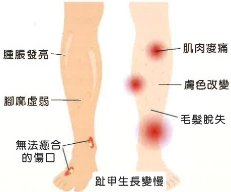

## 一、 周邊動脈阻塞性疾病是什麼樣的疾病

您的血管產生動脈硬化，造成血管變窄、阻塞和血流不順。

血管橫斷面圖

斑块减少血流供应

斑塊完全堵塞血管

## 二、 周邊動脈阻塞性疾病會有什麼症狀？

運動或爬樓梯時可引起漸進式的臀部大腿或小腿肌肉痠痛，隨著疾病嚴重度增加，症狀從腳冷，發麻到間歇性跛行，最後產生慢性無法癒合之傷口及組織壞死。

## 三、 要做什麼檢查才會知道有沒有周邊動脈阻塞疾病呢？

1. 杜普勒血流測試：用來檢查腳部動脈血流通暢的程度，可初步判斷動脈狹窄或阻塞的情形。

2. 周邊血管超音波：屬於進階的彩色都普勒血管超音波檢查，用來深入了解周邊

血管狀況，做為治療的依據。

3. 電腦斷層血管攝影：是一種結合X光和電腦影像的檢查與診斷工具，檢查過程約需15–20分鐘，可以使部位血管精確顯現出來。

4. 核磁共振攝影：是目前相當新穎、準確的檢查，可以顯現更清楚的血管阻塞部位。

## 四、 注意事项

1. 禁菸(含二手菸)：抽菸是最大的危險因子，因為尼古丁會造成動脈硬化，加速血管攣縮，並抑制側枝循環的形成，故應絕對禁止。

2. 治療糖尿病，將血糖控制於理想範圍。

3. 改善高血脂。

4. 控制血壓。

5. 改善其它系統疾病，如：冠狀動脈性心臟病，腦血管疾病等。

6. BMI(體重÷身高米平方)超過 25 需減重。

7. 改善貧血及血液黏稠性。

8. 注意足部護理，特別是糖尿病患，需穿合適的鞋子，避免受傷或傷口感染。

9. 適度運動：可以增加側枝循環。